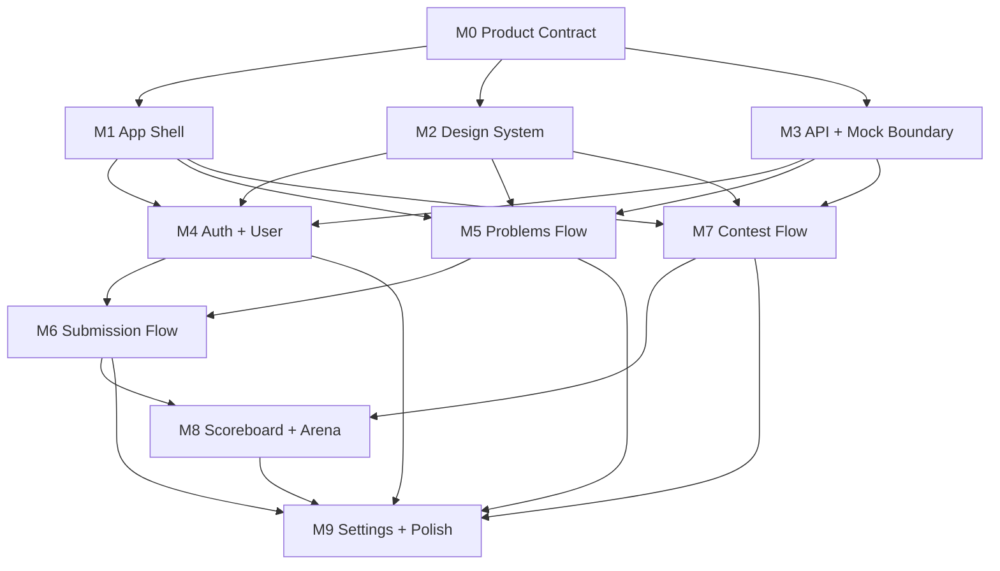

# SOJ-web v2 PRD/UX Top-Level Implementation Plan

> **For agentic workers:** REQUIRED: Use superpowers:subagent-driven-development (if subagents available) or superpowers:executing-plans to implement this plan. Steps use checkbox (`- [ ]`) syntax for tracking.

**Goal:** Build SOJ-web v2 from the approved PRD/UX spec as a user-facing online judge product with coherent flows, one global navigation model, and page-specific UI/UX.

**Architecture:** Implement from product flows outward: first lock shell, routes, design system, and API/mock boundaries, then build feature modules by user task flow. Pages share visual language and primitives but do not share one layout template.

**Tech Stack:** Next.js App Router, React, TypeScript, Tailwind CSS v4, Motion for stateful UI feedback, Radix-style primitives where useful, mock/real API boundary based on OpenAPI.

---

## Source Documents

- PRD/UX spec: `docs/superpowers/specs/2026-07-07-soj-web-v2-prd-ux-design.md`
- Visual direction spec: `docs/superpowers/specs/2026-07-07-soj-web-v2-signal-arena-design.md`
- OpenAPI inventory: `docs/development/openapi-inventory.md`
- Existing implementation reference: `app/**`, `features/**`, `components/**`

## Planning Level

This plan is intentionally top-level. It defines modules, ownership boundaries, dependency order, and acceptance checkpoints. It does not prescribe file-by-file code tasks or detailed test cases.

## Global Constraints

- [ ] Preserve one global Header only.
- [ ] Keep global navigation limited to Home, Problems, Contests, and Submissions.
- [ ] Keep Me and Settings in the user menu.
- [ ] Keep Submission Result, Scoreboard, and Arena context-only.
- [ ] Keep admin/operator workflows out of first release.
- [ ] Use shared components and tokens instead of page-local primitives.
- [ ] Treat OI/IOI scoreboard and Arena events as mock/API-gap aware surfaces.
- [ ] Do not mix implementation work with unrelated `next-env.d.ts` local changes.

## Module Dependency Order

## Module 0: Product Contract Lock

**Purpose:** Turn the approved PRD/UX spec into implementation guardrails before page work begins.

**Owns:**

- Route classification.
- Button behavior contract.
- Context preservation rules.
- Auth and permission intercept rules.
- Submission, run, contest, and scoreboard status mapping.

**Outputs:**

- PRD/UX spec remains the source of truth.
- A short implementation checklist can be added to developer docs if needed.

**Acceptance:**

- [ ] Every route is classified as global, user-menu, context-only, internal-only, or out of scope.
- [ ] `next` redirect handling is encoded, same-origin, and relative-only.
- [ ] Backend enum mappings match OpenAPI.
- [ ] Mock-only API gaps are explicitly tracked.

## Module 1: App Shell And Navigation

**Purpose:** Establish the single product frame that every page uses.

**Owns:**

- Root layout.
- One global Header.
- User menu.
- Search/help scope for first release.
- Breadcrumb/context navigation for deep pages.
- Route guard shell behavior.

**Key decisions:**

- Header is product navigation, not a demo switcher.
- Scoreboard, Arena, Submission Result, Settings, and Me are not global nav tabs.
- Deep pages may use breadcrumbs, but breadcrumbs never become a second header.

**Acceptance:**

- [ ] Only one global Header renders on all product pages.
- [ ] Active nav state is correct for global sections.
- [ ] Context pages have a clear parent-return path.
- [ ] User menu handles visitor and authenticated states.

## Module 2: Design System Foundation

**Purpose:** Fix shared UI quality before feature pages diverge.

**Owns:**

- Tokens.
- Typography.
- Surface model.
- Buttons and icon buttons.
- Inputs, selects, tabs, filters.
- Data rows and tables.
- Modal, drawer, popover, toast.
- Loading, empty, error, permission, and not-found states.

**Key decisions:**

- Shared style, not shared page template.
- Components own interaction states.
- Motion is state feedback, not decoration.

**Acceptance:**

- [ ] Components cover default, hover, active, focus, disabled, loading, and error states where applicable.
- [ ] Page teams do not create one-off button/input/table/badge variants.
- [ ] Style guide route remains internal/dev-only.
- [ ] Visual baseline supports both dense data surfaces and reading surfaces.

## Module 3: API And Mock Boundary

**Purpose:** Make page work independent from backend availability while staying contract-aware.

**Owns:**

- API client boundary.
- Mock adapter boundary.
- Domain models for problems, submissions/runs, contests, scoreboards, Arena.
- Contract-to-UI status mapping.
- Backend gap tracking.

**Key decisions:**

- Mock fields that exceed OpenAPI must be isolated and documented.
- Submission and run statuses follow `JudgeStatus`.
- Contest lifecycle follows `ContestStatus`; freeze follows scoreboard view/cell fields.

**Acceptance:**

- [ ] Mock mode can power all first-release UI states.
- [ ] Real API adapter does not consume mock-only fields.
- [ ] Contest problem workspace contract gaps are explicit.
- [ ] OI/IOI and Arena gaps are explicit.

## Module 4: Auth, User Space, And Settings

**Purpose:** Enable identity, route intercepts, personal activity, and preferences.

**Owns:**

- Login.
- Register.
- Session restoration.
- Logout.
- Auth intercepts with safe `next`.
- `/me`.
- `/settings`.

**Key decisions:**

- Visitors can browse public pages.
- Gated actions preserve context through safe `next`.
- Me and Settings live behind the user menu.

**Acceptance:**

- [ ] Login/register return to safe encoded `next`.
- [ ] Gated actions redirect predictably.
- [ ] `/me` shows personal activity and shortcuts.
- [ ] `/settings` handles default language, editor preference, motion/theme preference, and logout.

## Module 5: Problems And Practice Flow

**Purpose:** Support finding, reading, and submitting public problems.

**Owns:**

- `/problems`.
- `/problems/[id]`.
- Problem filter rail.
- Problem row interactions.
- Reading-first problem detail.
- Submit drawer/side rail.
- Run Sample behavior.

**Key decisions:**

- Problems page is a work surface, not a marketing hero.
- Problem Detail is reading-first.
- Run Sample stays inline and does not become a submission result page.

**Acceptance:**

- [ ] Search and filters sync with URL query.
- [ ] Problem rows navigate and expose contextual submit behavior.
- [ ] Submit success navigates to Submission Result.
- [ ] Run Sample follows the Run lifecycle and stays in context.

## Module 6: Submission Flow

**Purpose:** Make judge feedback understandable and traceable.

**Owns:**

- `/submissions`.
- `/submissions/[id]`.
- Submission List filters.
- Submission Result.
- Timeline/lifecycle.
- Test point matrix.
- Source drawer.
- Contest impact display.

**Key decisions:**

- Submission Result means one judge result, not a generic detail page.
- Submission Result is context-only.
- Status presentation follows `JudgeStatus`.

**Acceptance:**

- [ ] Submission List supports filtering and context links.
- [ ] Submission Result explains queued/running/final statuses.
- [ ] Re-submit returns to the correct problem context.
- [ ] Scoreboard and contest submissions preserve contest context.

## Module 7: Contest Flow

**Purpose:** Support contest discovery, registration, detail, and solving.

**Owns:**

- `/contests`.
- `/contests/[id]`.
- `/contests/[id]/problems/[problemId]`.
- Contest registration states.
- Contest problem access states.
- Contest workspace.

**Key decisions:**

- Contest Detail is the contest information hub.
- Contest Workspace is a solving tool, not the same layout as public Problem Detail.
- Contest problem APIs need explicit mock/real boundary handling.

**Acceptance:**

- [ ] Contest list separates upcoming/running/ended intent.
- [ ] Contest Detail handles registration, rules, announcements, problem list, scoreboard, and Arena entry.
- [ ] Workspace supports statement/editor/timer/problem switching.
- [ ] Submit availability responds to contest status and permissions.

## Module 8: Scoreboard And Arena

**Purpose:** Provide accurate ranking and display-grade contest signal.

**Owns:**

- `/contests/[id]/scoreboard`.
- `/contests/[id]/arena`.
- ACM scoreboard.
- OI/IOI UI model.
- Scoreboard cell interactions.
- Arena event display.

**Key decisions:**

- Scoreboard prioritizes accuracy, density, and sticky structure.
- Arena is display-only, not a solving surface.
- OI/IOI and Arena may remain mock-ready until backend gaps close.

**Acceptance:**

- [ ] Scoreboard maps `ScoreboardView` and `ScoreboardCellStatus` correctly.
- [ ] Clickable cells navigate to Submission Result only when a submission exists.
- [ ] Arena supports fullscreen and exit without solving controls.
- [ ] Arena events expand in place instead of navigating away.

## Module 9: Cross-Page Polish And Verification

**Purpose:** Make the product coherent after modules land.

**Owns:**

- Route-to-route context checks.
- Empty/error/loading coverage.
- Permission coverage.
- Visual consistency.
- Responsive checks.
- Build/lint/type/test checks.

**Key decisions:**

- Polish is not a rewrite pass.
- Fix drift at shared component or shell level first.
- Page-specific layout differences are allowed when driven by task intent.

**Acceptance:**

- [ ] No duplicate global headers.
- [ ] No context-only pages appear in global nav.
- [ ] Every major button has defined behavior.
- [ ] Every core page has loading, empty, error, and permission states.
- [ ] Desktop and mobile layouts preserve readable hierarchy.

## Parallelization Strategy

Serial gates:

1. Module 0: Product Contract Lock.
2. Module 1: App Shell And Navigation.
3. Module 2: Design System Foundation.
4. Module 3: API And Mock Boundary.

Parallel after gates:

- Module 4: Auth, User Space, Settings.
- Module 5: Problems Flow.
- Module 6: Submission Flow, after shared status model is ready.
- Module 7: Contest Flow.
- Module 8: Scoreboard And Arena, after Contest and Submission models are stable.

Final serial pass:

- Module 9: Cross-Page Polish And Verification.

## Suggested Commit Rhythm

- Commit after each module lands and passes its local checks.
- Keep design-system changes separate from page feature commits when possible.
- Keep mock/API boundary changes separate from visual-only changes.
- Do not mix unrelated generated file churn into module commits.

## Top-Level Verification

Before implementation is considered ready for review:

- [ ] Install succeeds.
- [ ] Type check succeeds.
- [ ] Lint succeeds.
- [ ] Build succeeds.
- [ ] Mock mode covers all core routes.
- [ ] Key user flows work through navigation, not isolated page renders.
- [ ] PRD/UX button behavior is represented in UI.

## Handoff Note

This plan is intentionally not a task-by-task implementation script. Before coding, each module should be expanded into a focused worker task with explicit file ownership and verification commands.
