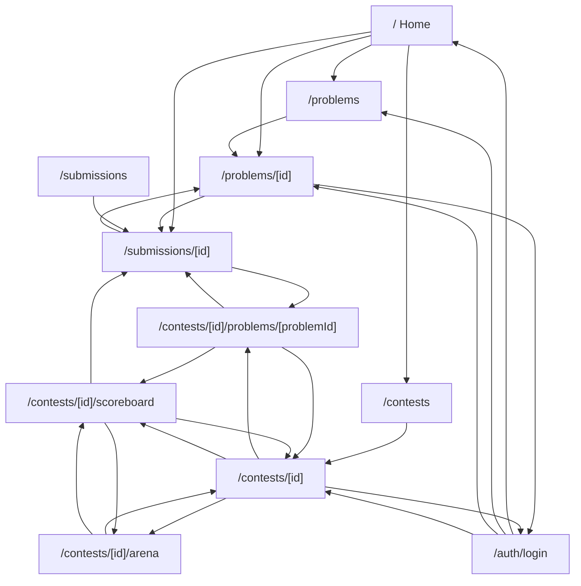

# SOJ-web v2 PRD And UI/UX Design

Date: 2026-07-07

## Status

Approved draft from brainstorming. This document defines the product requirements and UI/UX behavior for the SOJ-web v2 user-facing release. It does not authorize production implementation until reviewed and approved for planning.

## Scope

The first v2 release covers user-facing online judge workflows only.

In scope:

- Home and product entry.
- Login, registration, session restoration, and logout.
- Problem browsing, filtering, reading, and submitting.
- Submission list and submission result review.
- Contest list, contest detail, registration, and contest solving.
- ACM scoreboard.
- OI/IOI scoreboard UI model, with backend contract gaps documented.
- Arena big-screen contest display model, with backend contract gaps documented.
- User space and basic settings.
- Mock data mode for UI review and local development.

Out of scope for the first release:

- Admin dashboard.
- Problem authoring.
- Contest creation and management.
- Language management.
- Full operator workflows.
- Public social profile pages.

## Product Goal

SOJ-web v2 should feel like a polished competitive programming product, not a generic admin UI. The product must help users quickly answer:

- What can I do now?
- Which problem should I solve next?
- What happened to my submission?
- Can I join this contest?
- How is the contest ranking changing?

Visual design supports these flows, but the product design starts from task flow, button behavior, navigation, and state handling.

## Users

### Visitor

Can browse public problems, public contests, public scoreboards where allowed, and the homepage. Cannot submit, register for contests, or view private user data.

### Authenticated User

Can submit solutions, view personal submissions, join eligible contests, view personal activity, and update basic settings.

### Contest Participant

An authenticated user with contest registration or access. Can enter contest workspace, submit contest problems when allowed, and view contest-specific result context.

### Arena Viewer

Uses Arena mode for big-screen or live viewing. This is a display workflow, not a solving workflow.

### Admin

Admin is a future role. No admin UI is included in the first v2 release.

## Core Task Flows

### Flow 1: Enter The System

Goal: let users quickly enter practice, contests, login, or continue previous work.

Primary pages:

- `/`
- `/auth/login`
- `/auth/register`
- `/me`

Home behavior:

- `Start practice`
  - Authenticated: navigate to `/problems`, preserving recommended or last-used filters when available.
  - Visitor: navigate to `/problems`; submitting later triggers login.
- `View contests`
  - Navigate to `/contests`.
- `Continue last problem`
  - Authenticated with history: navigate to the last problem detail.
  - No history: hide this action.
- Recent submission item
  - Navigate to `/submissions/[id]`.
- Login
  - Navigate to `/auth/login`.
- Register
  - Navigate to `/auth/register`.

Auth behavior:

- Successful login or register navigates to `next` when present.
- If no `next` exists, navigate to `/`.
- Already-authenticated users visiting login/register should be redirected to `/` or `/me`.

Redirect safety:

- `next` must be URL-encoded when written into the query string.
- `next` must decode to a same-origin relative path beginning with `/`.
- Absolute URLs, protocol-relative URLs, JavaScript URLs, and cross-origin targets are invalid.
- Invalid `next` values fall back to `/`.
- Nested query examples must be encoded, for example `/auth/login?next=%2Fproblems%2F1482%3Fsubmit%3D1`.

### Flow 2: Find A Problem And Start Practice

Goal: help the user find the next problem to solve.

Primary pages:

- `/problems`
- `/problems/[id]`

Problem set behavior:

- Search updates the list in place and syncs `q` to URL query.
- Filters update the list in place and sync to URL query:
  - Status.
  - Tags.
  - Difficulty.
  - IO type.
- `Reset filters` clears query and returns to the default recommended list.
- Clicking a problem row navigates to `/problems/[id]`.
- Clicking a row-level submit shortcut:
  - Authenticated: navigate to `/problems/[id]?submit=1`.
  - Visitor: navigate to `/auth/login?next=<encoded relative target>`.
- Empty results show an empty state with `Reset filters`.

Problem detail behavior:

- The layout prioritizes reading.
- Submit controls live in a side rail or drawer.
- `Submit`
  - Authenticated: open submit drawer or side panel.
  - Visitor: navigate to login with `next`.
- Language select updates local submit state and stores user preference.
- IO type select:
  - Multiple IO types: user can switch IO mode and related instructions.
  - Single IO type: display only, not interactive.
- `Run sample`
  - Visitors can run public samples if the backend permits anonymous run creation; otherwise the action redirects to login with encoded `next`.
  - Opens an inline sample result panel in the submit rail or below the selected sample.
  - Creates a Run when backend mode supports it.
  - Uses the Run lifecycle defined in this document.
  - Shows output comparison inline on success.
  - Shows compile, runtime, timeout, or system error inline on failure.
  - `Retry sample` reuses the same language, source, sample id, and IO mode.
- `Submit solution`
  - Creates a submission.
  - On success: navigate to `/submissions/[id]`.
  - On failure: show inline error in submit panel.
- `Back to problems`
  - Return to `/problems`, preserving previous query.

### Flow 3: Review Submission Result

Goal: explain what happened to a single submission.

Primary pages:

- `/submissions`
- `/submissions/[id]`

Terminology:

- `/submissions` is Submission List, Chinese label: 提交记录.
- `/submissions/[id]` is Submission Result, Chinese label: 评测结果.
- Submission Result is not a global destination. It is reached from context.

Submission List behavior:

- Filters:
  - Problem.
  - User.
  - Language.
  - Status.
  - Contest.
  - Time.
- Filter state syncs to URL query.
- Clicking a submission row navigates to `/submissions/[id]`.
- Clicking a problem name navigates to the relevant problem context:
  - Public problem: `/problems/[id]`.
  - Contest problem: `/contests/[id]/problems/[problemId]`.
- `Only mine`
  - Visitor: navigate to login with `next`.
  - Authenticated: filter to current user.

Submission Result entry points:

- Submit success from public problem detail.
- Submit success from contest workspace.
- Submission List row click.
- Recent submission item.
- Scoreboard cell with `last_submission_id`.

Submission Result behavior:

- Shows verdict summary, lifecycle, tests, errors, source access, and contest impact.
- `Back to problem`
  - Public problem: navigate to `/problems/[id]`.
  - Contest problem: navigate to contest workspace.
- `Re-submit`
  - Navigate back to source problem context and open submit controls.
  - Preserve language when possible.
- `View source`
  - Open source drawer.
- `Copy error`
  - Copy compile/runtime error text.
  - Show success toast.
- While judging:
  - Poll or subscribe to lifecycle updates.
  - Show backend `JudgeStatus` values as user-facing Waiting, Executing, Accepted, judged failure, system error, or canceled states.
  - Stop updates after final state.

### Flow 4: Join And Participate In A Contest

Goal: let users understand contest state, register, solve, and inspect ranking.

Primary pages:

- `/contests`
- `/contests/[id]`
- `/contests/[id]/problems/[problemId]`
- `/contests/[id]/scoreboard`
- `/contests/[id]/arena`

Contest list behavior:

- Clicking contest card navigates to `/contests/[id]`.
- `Register`
  - Authenticated: call registration, update card state on success.
  - Visitor: navigate to `/auth/login?next=/contests/[id]`.
- Status filters update the list:
  - Upcoming.
  - Running.
  - Ended.

Contest detail behavior:

- Shows contest lifecycle, registration state, rules, announcements, problem list, scoreboard entry, Arena entry, and permission hints.
- `Register`
  - Authenticated and eligible: register, then show `Enter contest`.
  - Visitor: navigate to login with `next`.
  - Closed: disabled with reason.
- `Enter contest`
  - Not started: stay on detail and show start time.
  - Running: navigate to first available contest problem.
  - Ended: navigate to problem list area or scoreboard.
- Clicking a problem:
  - Has access: navigate to contest workspace.
  - No access: show permission state.
- `View scoreboard`
  - Navigate to `/contests/[id]/scoreboard`.
- `Open arena`
  - Navigate to `/contests/[id]/arena`.

Contest workspace behavior:

- Uses split layout:
  - Problem statement.
  - Code editor.
  - Contest timer.
  - Problem switcher.
  - Recent submissions.
- `Submit`
  - Creates contest submission.
  - On success: navigate to `/submissions/[id]` with contest context.
- `Next problem`
  - Navigate to next contest problem.
- `Problem list`
  - Navigate back to contest detail problem area.
- `Scoreboard`
  - Navigate to scoreboard.
- Contest ended or no permission:
  - Disable submit and explain why.

Backend contract note:

- Contest workspace requires contest-specific problem access data. Current documented OpenAPI inventory does not list a dedicated contest-problem statement/access endpoint. Until the backend contract is extended, mock mode must model contest problem membership, problem alias, statement visibility, permission reason, submit availability, and contest-specific problem navigation.

### Flow 5: Inspect Scoreboard And Arena

Goal: support accurate ranking and high-impact display.

Scoreboard behavior:

- Scoreboard is not a global nav item.
- Entry points:
  - Contest detail.
  - Contest workspace.
  - Arena.
- `ACM / OI view`
  - Show only if contest supports multiple scoring models.
  - Otherwise hide.
- `Freeze info`
  - Explain frozen state inline or via popover.
- Clicking a cell:
  - With `last_submission_id`: navigate to `/submissions/[id]`.
  - Without submission: no action.
- Large tables use sticky header and sticky rank/team columns.

Arena behavior:

- Arena is display mode.
- It does not include solving, submitting, filtering, or editing.
- `Fullscreen`
  - Enter browser fullscreen.
- `Exit arena`
  - Return to contest detail.
- Clicking an event expands event details in place.
- Event clicks do not navigate away, to avoid breaking big-screen display.

### Flow 6: Personal Space And Settings

Primary pages:

- `/me`
- `/settings`

Me behavior:

- Shows recent submissions, contest participation, problem progress, account state, and shortcuts.
- Clicking recent submission navigates to Submission Result.
- Clicking contest navigates to Contest Detail.
- Clicking problem progress navigates to Problem Detail or filtered Problem Set.
- Visitor: redirect to login.

Settings behavior:

- Manages:
  - Account info.
  - Default language.
  - Editor preference.
  - Theme/motion preference.
  - Logout.
- Save:
  - Shows loading state.
  - On success: toast.
  - On failure: inline error.
- Logout:
  - Confirm modal.
  - On confirm: logout and navigate to `/`.

## Information Architecture

### Global Header Entries

Only these pages are global entries:

- `/` Home.
- `/problems` Problems.
- `/contests` Contests.
- `/submissions` Submissions.

User menu entries:

- `/me`.
- `/settings`.
- Login/Register when unauthenticated.
- Logout action when authenticated.

Context-only pages:

- `/problems/[id]`.
- `/submissions/[id]`.
- `/contests/[id]`.
- `/contests/[id]/problems/[problemId]`.
- `/contests/[id]/scoreboard`.
- `/contests/[id]/arena`.

Internal-only routes:

- `/style-guide` is a development and review route for validating the SOJ design system.
- `/style-guide` is not part of production user navigation.
- `/style-guide` can be linked from developer documentation, PR review notes, or local QA instructions.
- If exposed outside local/dev environments, it must not contain private data or admin-only actions.

Rules:

- Scoreboard and Arena are not global header entries.
- Submission Result is not a global header entry.
- Settings is not a global header entry.
- Product UI has one global Header only.

### Route Relationship Diagram

## Page-Level PRD

### `/` Home

Goal: quick entry into practice, contests, and recent activity.

Primary regions:

- Hero and primary actions.
- Active contest signal.
- Continue practice.
- Recent submissions.
- Recommended problems.

Entry:

- Direct visit.
- Login success without `next`.

Exit:

- `/problems`.
- `/contests`.
- `/problems/[id]`.
- `/submissions/[id]`.
- Auth pages.

States:

- Visitor: show login/register and public entries.
- Authenticated: show continue practice and personal signals.
- No active contests: show upcoming contests.
- Data failure: preserve primary entries and show local weak error.

### `/auth/login` And `/auth/register`

Goal: authenticate and return to the intended flow.

Primary regions:

- Form.
- Inline errors.
- Switch login/register link.
- `next` context hint when useful.

Entry:

- Header/user menu.
- Submit intercept.
- Register intercept.
- Only-mine intercept.

Exit:

- `next`, if present.
- `/`, if no `next`.

States:

- Field validation error.
- Auth failure.
- Loading.
- Already authenticated redirect.

### `/problems`

Goal: find the next problem.

Primary regions:

- Filter rail.
- Search.
- Problem rows.
- Sorting.
- Empty state.

Entry:

- Header.
- Home.
- Problem Detail back action.

Exit:

- Problem Detail.
- Login if user attempts a gated submit shortcut.

States:

- Loading skeleton.
- Empty results with reset action.
- API failure with retry.
- Visitor browsing.

### `/problems/[id]`

Goal: read the problem and submit.

Primary regions:

- Statement.
- Samples.
- Constraints.
- Tags and stats.
- Submit side rail or drawer.
- Recent submissions.

Entry:

- Problem Set.
- Home recommendation.
- Submission Result back action.

Exit:

- Submission Result.
- Problems.
- Login.

States:

- Not found.
- Permission denied.
- Submit loading.
- Submit failure.
- IO mode display or switch.

### `/submissions`

Goal: find prior submissions.

Primary regions:

- Submission filters.
- Submission rows.
- Status indicators.
- Optional summary.

Entry:

- Header.
- Me.
- Problem Detail.
- Contest Detail.

Exit:

- Submission Result.
- Problem context.
- Contest workspace context.

States:

- Public list for visitors.
- `Only mine` requires login.
- Empty list.
- Judging rows update.
- API failure with retry.

### `/submissions/[id]`

Goal: explain one submission result.

Primary regions:

- Verdict summary.
- Lifecycle timeline.
- Test point matrix.
- Error details.
- Source drawer.
- Contest impact.

Entry:

- Submit success.
- Submission List.
- Problem recent submissions.
- Scoreboard cell.

Exit:

- Back to public problem.
- Back to contest workspace.
- Re-submit.
- View source drawer.

States:

- Queued.
- Running.
- Accepted.
- Wrong Answer.
- Time Limit Exceeded.
- Memory Limit Exceeded.
- Runtime Error.
- Compile Error.
- System Error.
- Canceled.
- Permission restricted.

### `/contests`

Goal: choose a contest.

Primary regions:

- Contest status filters.
- Highlight running/upcoming contest.
- Contest cards.
- Registration state.

Entry:

- Header.
- Home.

Exit:

- Contest Detail.
- Login.

States:

- Upcoming.
- Running.
- Ended.
- Empty.
- Registration failure.

### `/contests/[id]`

Goal: understand, register, enter, and inspect contest.

Primary regions:

- Contest title and lifecycle.
- Registration/entry action.
- Rules.
- Announcements.
- Problem list.
- Scoreboard entry.
- Arena entry.
- Permission hints.

Entry:

- Contest List.
- Home.
- Scoreboard/Arena back action.

Exit:

- Contest workspace.
- Scoreboard.
- Arena.
- Login.

States:

- Not registered.
- Registered, not started.
- Running.
- Ended.
- Registration closed.
- Permission denied.

### `/contests/[id]/problems/[problemId]`

Goal: solve contest problem efficiently.

Primary regions:

- Problem statement.
- Code editor.
- Contest timer.
- Problem switcher.
- Submit controls.
- Recent submissions.

Entry:

- Contest Detail.
- Next/previous problem action.

Exit:

- Submission Result.
- Contest Detail.
- Scoreboard.
- Other contest problem.

States:

- Not started.
- Running.
- Frozen scoreboard.
- Ended.
- No permission.
- Submit loading.

### `/contests/[id]/scoreboard`

Goal: inspect ranking accurately.

Primary regions:

- Contest header.
- Freeze info.
- View model, when applicable.
- Scoreboard table.
- Sticky rank/team columns.

Entry:

- Contest Detail.
- Contest Workspace.
- Arena.

Exit:

- Contest Detail.
- Submission Result from a cell.
- Arena.

States:

- ACM display.
- OI/IOI display.
- Frozen.
- Loading large table.
- API failure.

### `/contests/[id]/arena`

Goal: present contest signals for big-screen viewing.

Primary regions:

- Large contest status.
- Freeze countdown.
- Rank movement.
- Accepted events.
- Key submission feed.
- Fullscreen and exit controls.

Entry:

- Contest Detail.
- Scoreboard.

Exit:

- Contest Detail.
- Scoreboard.

States:

- Waiting for events.
- Not started.
- Running.
- Frozen.
- Ended.

### `/me`

Goal: personal activity and shortcuts.

Primary regions:

- Account summary.
- Recent submissions.
- Contest participation.
- Problem progress.
- Settings shortcut.

Entry:

- User menu.
- Login success if chosen.

Exit:

- Submission Result.
- Problem Detail.
- Contest Detail.
- Settings.

States:

- Visitor redirect.
- No submissions.
- No contests.
- Local API failure.

### `/settings`

Goal: manage basic preferences.

Primary regions:

- Account.
- Default language.
- Editor preference.
- Theme/motion preference.
- Logout.

Entry:

- User menu.
- Me.

Exit:

- Stay on page after save.
- Logout to `/`.

States:

- Save loading.
- Save success toast.
- Inline save failure.
- Logout confirmation.

## Global UX Rules

### Header

- One global Header only.
- Left: SOJ brand.
- Center: Home, Problems, Contests, Submissions.
- Right: global search, help, user menu.
- Me and Settings are in the user menu.
- Context-only pages are not main nav entries.

First-release right-side behavior:

- Global search opens a command/search popover.
  - Querying searches public problems and contests in mock mode.
  - Selecting a problem navigates to Problem Detail.
  - Selecting a contest navigates to Contest Detail.
  - Empty search shows "No matching problems or contests" and a link to Problems.
  - Search failure keeps the popover open and shows a local retry action.
- Help opens a small popover with links to project help text or keyboard shortcuts when available.
  - If help content is not ready, hide this control in production.
- Notifications are not in first-release scope.
  - Do not show a notification icon unless notification data and empty/error behavior are designed.
- User menu shows login/register for visitors and Me/Settings/Logout for authenticated users.

### Navigation Context

- Breadcrumbs appear only on deep pages:
  - Problem Detail.
  - Contest Detail.
  - Contest Workspace.
  - Scoreboard.
  - Submission Result.
- Breadcrumbs return to parent context.
- They do not replace global navigation.

### Button Hierarchy

Primary:

- Submit solution.
- Register.
- Enter contest.
- Start practice.

Secondary:

- View scoreboard.
- Back to problems.
- Run sample.

Ghost/Icon:

- Copy error.
- View source.
- Fullscreen.
- Refresh.

Danger:

- Logout.
- Cancel registration, if added later.

Rules:

- One page primary area should have at most one primary action.
- Disabled buttons must explain why.
- Loading buttons preserve width.
- Every button has hover, active, focus, disabled, and loading states where applicable.

### Modal, Drawer, Popover, Toast

Modal:

- Confirmation actions only.
- Example: logout confirmation.

Drawer:

- Complex secondary workflows that should not leave the page.
- Examples: submit panel, source viewer.

Popover:

- Lightweight explanation or selection.
- Examples: language select, IO mode explanation, freeze info.

Toast:

- Short feedback.
- Examples: saved, copied, registered.
- Errors prefer inline display.

### Auth And Permission Intercepts

- Public browse remains available when possible.
- Gated actions use login with `next`.
- No permission state stays in context and explains the reason.
- Contest permissions are explicit:
  - Not registered.
  - Not started.
  - Running.
  - Ended.
  - Archived.

### Loading, Empty, Error

Every core page must define:

- Loading skeleton matching final layout.
- Empty state with next action.
- Error state with retry or navigation.
- Permission denied state with explanation.
- Not found state with return path.

Rules:

- Do not use full-screen spinner for complex pages.
- Do not show only "No data".
- Do not show only "Error".
- Prefer local error where only one region failed.

## State Models

### Submission Lifecycle

Submission and Run status use the backend `JudgeStatus` enum.

Contract statuses:

- `queued`.
- `running`.
- `accepted`.
- `wrong_answer`.
- `compile_error`.
- `runtime_error`.
- `time_limit`.
- `memory_limit`.
- `system_error`.
- `canceled`.

UI groupings:

- Waiting: `queued`.
- Executing: `running`.
- Final success: `accepted`.
- Final judged failure: `wrong_answer`, `time_limit`, `memory_limit`, `runtime_error`, `compile_error`.
- Final system/user stop: `system_error`, `canceled`.

Rules:

- Submit success navigates to Submission Result.
- Submission Result updates while status is `queued` or `running`.
- `accepted` shows passed tests, time, and memory.
- `wrong_answer`, `time_limit`, `memory_limit`, and `runtime_error` show case summaries where safe.
- `compile_error` shows compiler output.
- `system_error` explains retry/later-view action.
- `canceled` explains that the run was canceled and should not be presented as judge failure.

### Run Sample Lifecycle

Run Sample uses backend Runs when available and follows the same `JudgeStatus` enum as submissions. It is not presented as a judged submission unless the backend explicitly models it that way.

Local UI phases:

- Idle: no sample run is active.
- Creating: frontend is creating the run request.
- Waiting: backend status `queued`.
- Executing: backend status `running`.
- Finished: backend status is one of the final `JudgeStatus` values.

Result presentation:

- `accepted`: output matched the sample.
- `wrong_answer`: output mismatch.
- `compile_error`: compiler output.
- `runtime_error`: runtime failure.
- `time_limit`: sample run timed out.
- `memory_limit`: sample run exceeded memory.
- `system_error`: judge infrastructure error.
- `canceled`: run was canceled.

Rules:

- Run Sample does not create a Submission List item unless the backend explicitly models runs as submissions.
- Run Sample result remains in the current Problem Detail or Contest Workspace.
- Run Sample can be retried from the result panel.
- Run Sample failure uses inline error, not Toast.
- If anonymous runs are disabled, visitors are redirected to login with a safe encoded `next`.

### Contest Lifecycle

Contest lifecycle uses the backend `ContestStatus` enum plus registration and scoreboard-view context.

Contract statuses:

- `draft`.
- `published`.
- `running`.
- `ended`.
- `archived`.

UI groupings:

- Draft/internal: `draft`, not shown in first-release user navigation.
- Upcoming/open detail: `published`.
- Running: `running`.
- Ended: `ended`.
- Archived: `archived`.

Registration is not a contest status. Registration UI is derived from registration API state, contest time window, and permission checks.

Frozen is not a contest status. Freeze UI is derived from scoreboard view and scoreboard cell fields.

Rules:

- `published`: show contest detail, registration/wait state, and locked problems when appropriate.
- `running`: show enter contest, scoreboard, and Arena.
- Scoreboard `frozen` view: show freeze context; submission remains allowed if contest status is `running`.
- `ended`: submit disabled, results and replay available.
- `archived`: read-only.

### Backend-To-UI Status Mapping

Submission status mapping:

| Contract `JudgeStatus` | UI group | UI label |
| --- | --- | --- |
| queued | Waiting | Queued |
| running | Executing | Running |
| accepted | Final success | Accepted |
| wrong_answer | Final judged failure | Wrong Answer |
| compile_error | Final judged failure | Compile Error |
| runtime_error | Final judged failure | Runtime Error |
| time_limit | Final judged failure | Time Limit Exceeded |
| memory_limit | Final judged failure | Memory Limit Exceeded |
| system_error | Final system failure | System Error |
| canceled | Final canceled | Canceled |

Contest status mapping:

| Contract `ContestStatus` | UI group | UI label |
| --- | --- | --- |
| draft | Internal | Draft |
| published | Upcoming/open detail | Published |
| running | Running | Running |
| ended | Ended | Ended |
| archived | Archived | Archived |

Scoreboard freeze mapping:

| Contract field | UI meaning |
| --- | --- |
| ScoreboardResponse.view = live | Live scoreboard |
| ScoreboardResponse.view = frozen | Scoreboard is frozen |
| ScoreboardResponse.view = final | Final scoreboard |
| frozen_attempts > 0 | Cell has hidden attempts during freeze |
| accepted_at hidden or null in frozen view | Accepted time is concealed until final view |

Scoreboard cell status mapping:

| Contract `ScoreboardCellStatus` | UI meaning | UI behavior |
| --- | --- | --- |
| none | No visible submission for this problem | Render neutral empty cell with no click action |
| attempted | One or more failed visible submissions | Render attempted/failed styling, show attempts count, click if `last_submission_id` exists |
| accepted | Accepted visible submission | Render accepted styling, show accepted time/penalty when available, click if `last_submission_id` exists |
| frozen | Hidden activity during freeze | Render frozen styling, show frozen attempts if available, no result details until final view |

### Scoreboard State

ACM fields currently available:

- Rank.
- Display name.
- Accepted count.
- Penalty minutes.
- Cell status.
- Attempts.
- Frozen attempts.
- Accepted time.
- Last submission id.

OI/IOI mock-only gaps:

- Contest scoring mode.
- Total score.
- Per-cell partial score.
- Max score.
- Highest scoring submission.
- Score delta.
- Subtask breakdown.

### Arena State

Mock-only gaps:

- Arena event endpoint.
- Rank movement event.
- First accepted event.
- Freeze countdown projection.
- Score delta projection.
- Display-safe participant metadata.

Arena mock data must be clearly isolated from real API adapters.

## UI Design Principles

Shared visual language:

- Dark metal surfaces.
- Fine grid.
- Signal/runway motif where it communicates judge, rank, or contest movement.
- One accent color.
- Semantic status colors.
- Stable dimensions for tables, rows, score cells, counters, and buttons.

Page-specific layout:

- Home: brand entry and signal surface.
- Problems: filter rail and dense problem rows.
- Problem Detail: reading-first layout.
- Submission Result: lifecycle and explanation.
- Contests: event cards and contest lifecycle.
- Contest Workspace: split statement/editor workspace.
- Scoreboard: dense table and sticky structure.
- Arena: large motion and display scale.
- Auth/Me/Settings: quieter utility pages.

Rules:

- Do not reuse one page template for every route.
- Do not add multiple global headers.
- Do not place context pages in global navigation.
- Do not overuse cards where rows, rails, or panels work better.
- Motion must communicate state or feedback.

## Component Inventory

Foundation:

- Header.
- Button.
- IconButton.
- Input.
- Select.
- Tabs.
- Dialog.
- Drawer.
- Popover.
- Toast.
- Table.
- DataRow.

SOJ components:

- FilterRail.
- StatusPill.
- VerdictBadge.
- ProblemStatus.
- SubmitDrawer.
- SubmissionTimeline.
- TestPointMatrix.
- ContestCard.
- ContestClock.
- ContestProblemTable.
- CodeWorkspace.
- ScoreboardGrid.
- RankMovement.
- ArenaEventFeed.
- EmptyState.
- ErrorState.
- PermissionState.
- LoadingSkeleton.

Component rules:

- No page-local button, input, table, badge, or toast variants.
- Page-specific composition is allowed.
- Shared primitives own states and interaction quality.

## API And Mock Boundary

Existing usable API areas:

- Auth.
- Current user.
- Problems.
- Problem statement.
- Problem stats.
- Submissions.
- Runs.
- Contests.
- Registration.
- ACM scoreboard.

Known backend gaps:

- Contest problem membership endpoint or response fields.
- Contest problem statement visibility and permission reason.
- Contest problem alias/order data.
- Contest-specific submit availability.
- OI/IOI scoring fields.
- Arena event feed.
- Rank movement event stream.
- Freeze projection events.
- Score delta event stream.
- Public display-safe participant metadata.

Mock mode rules:

- Mock data supports all UI states.
- Mock-only fields must be documented.
- Mock adapters must not become a parallel production API.
- Real API adapters must reconcile gaps before real integration.

## Acceptance Criteria

PRD completeness:

- Every core page has a goal, entry, exit, primary regions, and states.
- Every main button has a defined behavior.
- Context-only pages are clearly identified.
- Submission Result is clearly defined as the result page for one judge submission.

UX completeness:

- Product uses one global Header.
- Global navigation contains only primary routes.
- Login and permission intercepts preserve context.
- Loading, empty, error, permission, and not found states are specified.
- Contest and submission lifecycles are explicit.

UI completeness:

- Pages share visual language but do not reuse one template.
- Components have distinct interaction states.
- Scoreboard prioritizes accuracy and readability.
- Arena is display-only and does not include solving actions.

Implementation readiness:

- Routes map cleanly to user flows.
- Component inventory is sufficient for implementation planning.
- API and mock boundaries are documented.
- Backend gaps are explicit.

## Follow-Up Before Implementation Planning

- Review this PRD/UX spec for missing user flows.
- Decide exact UI copy for Chinese and English labels.
- Decide whether first implementation keeps Arena mock-only.
- Decide whether OI/IOI scoreboard ships as mock-ready UI or waits for backend contract extension.
- Convert this document into an implementation plan after approval.
