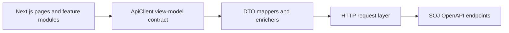

# SOJ Frontend-Backend API Adaptation Design

Date: 2026-07-08
Repos:
- Backend: `SOJ`
- Frontend: `SOJ-web`

## Goal

Align SOJ-web v2 with the SOJ backend OpenAPI contract and prepare both sides for frontend-backend integration testing.

The first integration pass should make real HTTP mode usable for the main user-facing surfaces:
- Auth session
- Problems
- Problem detail and submission workspace
- Languages
- Submissions and runs
- Contests and scoreboard
- Home page derived data

This design does not change page design or implement endpoints. It defines the adaptation boundary and the work list for later implementation.

## Current Contract Shape

The backend OpenAPI contract lives at `SOJ/api/openapi.yaml`.

Backend responses use an envelope shape:

```ts
{
  data?: T;
  error?: { code: string; message: string } | null;
}
```

SOJ-web currently exposes page-facing view models through `lib/api/types.ts`. These types are richer and more UI-oriented than backend DTOs. For example:
- Frontend `ProblemStatus` means user solve state, while backend `ProblemStatus` means publication state.
- Frontend contest lifecycle includes `scheduled`, `frozen`, and `unsealed`, while backend status uses `draft`, `published`, `running`, `ended`, and `archived`.
- Frontend submissions display `problemTitle`, while backend submission responses only include `problem_id`.

Because of that mismatch, the integration should not replace frontend view models with OpenAPI DTOs directly.

## Recommended Architecture

Keep the current page-facing `ApiClient` contract as the UI boundary, and introduce a backend HTTP adaptation layer underneath it.



The frontend should have three distinct layers:

- **Backend DTO types**: mirror OpenAPI response/request fields.
- **HTTP transport**: handles base URL, auth header, envelope parsing, errors, pagination, and cache mode.
- **Mappers/enrichers**: convert backend DTOs into existing SOJ-web view models and fill fields that need aggregation.

This keeps page code stable while making backend contract gaps explicit.

## Work Modules

### 1. API Foundation

Build the shared HTTP foundation before connecting feature modules.

Scope:
- General `request<T>()` helper.
- Envelope parsing for success and error responses.
- `Authorization: Bearer <access_token>` support.
- Query parameter builder for pagination and filters.
- Error mapping for `401`, `403`, `404`, `409`, `422`, and `500`.
- Decide local dev transport: Next dev proxy or backend CORS.

Output:
- HTTP mode can call authenticated and anonymous endpoints predictably.
- All later modules use the same request/error behavior.

### 2. Auth

Connect the auth session to real backend tokens.

Backend endpoints:
- `POST /api/v1/auth/register`
- `POST /api/v1/auth/login`
- `POST /api/v1/auth/refresh`
- `POST /api/v1/auth/logout`
- `GET /api/v1/me`

Frontend mapping:
- `UserResponse.username` becomes `CurrentUser.handle` and `CurrentUser.displayName`.
- Backend role maps directly to `user | admin | root`.
- Access and refresh token lifetime should be handled in the session layer.

Open decision:
- Whether refresh should be automatic in the request helper or explicit in auth flows.

### 3. Problems

Connect problem list and detail through backend data plus statement and stats aggregation.

Backend endpoints:
- `GET /api/v1/problems`
- `GET /api/v1/problems/{id}`
- `GET /api/v1/problems/{id}/statement`
- `GET /api/v1/problems/{id}/stats`

Frontend mapping:
- `ProblemResponse + ProblemStatementResponse + ProblemStatsResponse` becomes `ProblemDetail`.
- Backend publication status must not be reused as frontend solve status.
- Until backend exposes user-problem progress, frontend solve status should be defaulted or hidden from HTTP mode.

Backend contract gap:
- User-specific problem progress: `todo | attempted | accepted`.

### 4. Languages

The frontend submission UI needs enabled judge languages for every problem.

Current backend endpoint:
- `GET /api/v1/admin/languages`

Issue:
- This is an admin endpoint, but normal users need language choices before submitting.

Preferred backend contract:
- Add or expose a public/user endpoint such as `GET /api/v1/languages?enabled=true`.

Temporary frontend behavior:
- Keep the existing mapper shape for `JudgeLanguage`.
- Avoid hardcoding a default language per problem.

### 5. Submissions And Runs

Connect submit, self-run, submission list, and submission detail.

Backend endpoints:
- `POST /api/v1/submissions`
- `GET /api/v1/submissions`
- `GET /api/v1/submissions/{id}`
- `POST /api/v1/runs`
- `GET /api/v1/runs/{id}`

Frontend mapping:
- Add backend judge statuses: `time_limit`, `memory_limit`, `canceled`.
- Decide how to treat frontend-only `compiling`, because backend does not expose it.
- Enrich `SubmissionSummary.problemTitle` from cached/listed problems, or add title to backend response later.

Backend contract gap:
- Submission list does not include joined problem title.

### 6. Contests And Scoreboard

Connect contest list, contest detail, registration, and ACM scoreboard.

Backend endpoints:
- `GET /api/v1/contests`
- `GET /api/v1/contests/{id}`
- `POST /api/v1/contests/{id}/registrations`
- `GET /api/v1/contests/{id}/scoreboard`

Frontend mapping:
- Map backend status and timestamps into frontend contest phase.
- Treat backend scoreboard as ACM-style first.
- Keep OI/IOI and advanced arena projections as explicit contract gaps.

Backend contract gaps:
- Contest scoring mode or type.
- Current user's registration state.
- OI/IOI scoreboard fields.
- Arena event feed.

### 7. Home And Arena Derived Data

The home page can be derived from contests, problems, submissions, and scoreboard data.

Arena should not block core integration. Until backend exposes an event feed, it can remain derived from submissions and scoreboard data or stay in mock mode for event-specific visuals.

## Error Handling

HTTP mode should show consistent user-facing behavior:
- `401`: unauthenticated, guide user to login.
- `403`: authenticated but not allowed.
- `404`: use existing not-found page handling.
- `409`: conflict state, such as contest registration or submission constraints.
- `422`: validation feedback for forms.
- `500`: generic backend failure with retry affordance.

Every thrown API error should preserve:
- HTTP status
- backend error code
- backend message

## Integration Strategy

Recommended order:

1. API foundation
2. Auth
3. Languages
4. Problems
5. Submissions and runs
6. Contests and scoreboard
7. Home and Arena derived data
8. Local full-flow smoke test

This order makes submit flow possible as early as possible while keeping backend contract gaps visible.

## Verification Plan

Use focused verification first; defer large e2e flows until the integration stabilizes.

Required checks:
- Unit tests for envelope parsing and error mapping.
- Mapper tests using OpenAPI-shaped fixtures.
- HTTP adapter tests with mocked `fetch`.
- Local smoke with backend and frontend in HTTP mode:
  - login
  - load problem list
  - load problem detail
  - load language list
  - create run or submission
  - load submission list/detail
  - load contest list/detail/scoreboard

## Backend Follow-Up List

These are backend contract decisions needed for a complete v2 experience:

- Public enabled language list endpoint.
- User problem progress endpoint or fields.
- Submission list problem title enrichment.
- Contest registration state for current user.
- Contest scoring mode.
- OI/IOI scoreboard contract.
- Arena event feed contract.
- Browser CORS policy or documented frontend proxy setup.

## Non-Goals For This Pass

- No visual redesign.
- No large e2e suite.
- No admin authoring surfaces.
- No OI/IOI scoreboard implementation unless backend contract is added first.
- No Arena event backend unless explicitly scoped as a backend follow-up.
